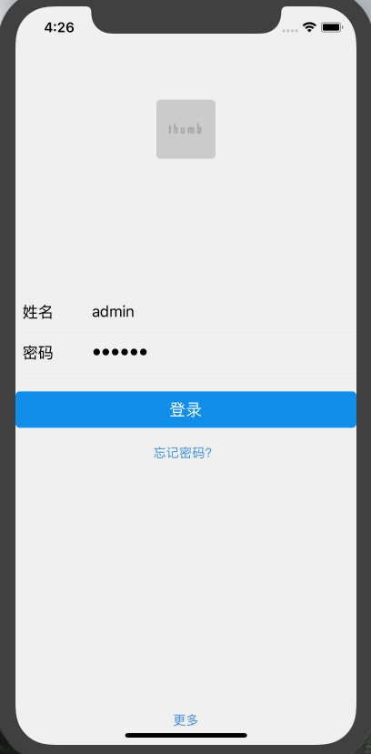

## 介绍
高效脚手架一枚，欢迎使用~
如果报错的话 请提个issues~
另外服务端用的是egg搭建  集成socket,redis（功能还在完善~）代码（https://github.com/Murrayee/m-server）

## start
- yarn install （尽量用yarn 安装 ，npm有可能会出问题 ）
- yarn run ios (android)

## screen

## 功能
- react-redux + react-navigation

- 即时聊天

## 更新提示

- 会持续更新

## more

- 内有上线 （react 技术栈 和 vue 技术栈）开发的web产品，因为是线上产品，所以。。。

